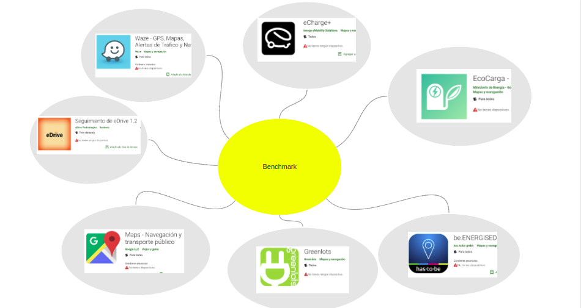
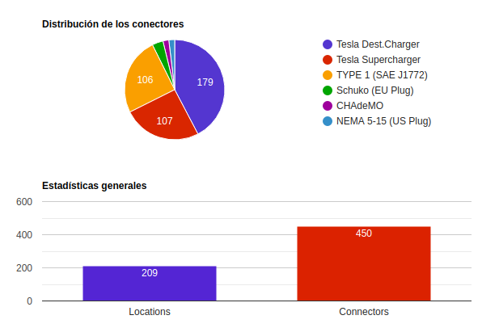
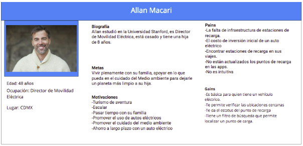
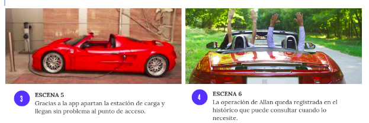

# M Ü E V E ⚡🔋

## Índice

- [Descripción](#resumen-del-proyecto)
- [Objetivos](#objetivos)
- [Problema](#problema)
- [Etapa de descubrimiento](#etapa-de-descubrimiento)
- [Benchmark](#benchmark)
- [User Personas](#user-personas)
- [Storyboard](#storyboard)
- [Propuesta de valor](#propuesta)
- [Prototipado](#prototipado)
- [Testing](#testing)
- [Propuesta](#propuesta)
- [Construido con](#construido-con)

## Descripción 📲

Müeve es una **aplicación móvil** con la cual los usuarios de automóviles electrónicos podrán **encontrar las estaciones de carga más cercanas desocupadas**, iniciar la carga por medio de un código QR, pagar el servicio y tener un historial de consumo. 

Esta aplicación fue desarrollada por Au haus y Engine Factory, quienes buscan crear la red de carga inteligente más grande y eficiente en México. 

El reto de nuestro equipo, comprendido por Viviana Navarro, Ariadna Gutiérrez, Elizabeth Ramírez y Karen Amicone, consiste en **mejorar el diseño UX y UI** de Müeve.

## Objetivos 📌

El objetivo de este reto será el **rediseño UX y UI de una aplicación móvil** enfocada al usuario final, implementando las mejoras en su experiencia. Deberá ser visualmente atractiva y sencilla de utilizar.

La app necesita ser mas atractiva e intuitiva.

Los objetivos particulares de la empresa son: 

1. Experiencia de la interfaz sencilla y agradable.
2. Plantear un ecosistema de carga para formar una app.
3. Conocer puntos de carga (Mapa).
4. Estándares de cargador.
5. Potencia. ¿Qué tan rápido puedes cargar tu carro?
6. Interacción de carga (Dashboard).
7. Apartar cargador. (Engagement) por cantidad.
8. Puedan añadir puntos de carga que no estén en el mapa.
9. Generar ruta y mapearla. 
10. Estimación de tiempo.
11. Saber si la estación es gratuita o de cobro.

## Benchmark 📊

- 

### Ecocarga 🌳🔋

 En la aplicación cualquier usuario puede visualizar en un mapa las estaciones disponibles en Chile. El usuario puede, si así lo desea, ingresar la marca y modelo de su vehículo eléctrico para filtrar las estaciones que son compatibles con su vehículo. Además puede hacer una estimación del tiempo de carga en las distintas estaciones que se despliegan en el plano.
 
**Pros:** 👍
- Muestra sólo aquellas estaciones que son compatibles con el vehículo.
- Estima el tiempo de carga en las distintas estaciones que se despliegan en el plano.
- El usuario ingresa datos de su auto sólo si así lo desea.

**Contras:** 👎
- Mal referenciada en el mapa.
- No hay instrucciones de cómo cargar.
- No permite calcular el tiempo de carga de motocicletas y monopatines.
- No incluye todas las marcas de híbridos.

### eCharge ✅

Muestra la estación de carga disponible más cercana. Usa una gran red de estaciones de carga pública en continua expansión. La carga es rápida y fácil. Además es posible pagar con diferentes métodos de pago como PayPal, tarjeta de crédito, el contrato de electricidad o un cupón.

**Pros:** 
- Encuentra las estaciones de carga en el área o cerca de una dirección específica.
- Filtra el mapa general según la estación de carga correspondiente.
- Permite consultar la disponibilidad de puntos de recarga en tiempo real.
- Agrega el método de pago una vez lo utiliza siempre.
- Varios métodos de pago.
- Supervisa la sesión de carga activa y sigue el progreso de carga.
- Guarda las estaciones de carga de uso habitual como favoritos.
- Revisa las sesiones de carga anteriores y los costos en cualquier momento.
- Proporciona información sobre la contribución al medio ambiente por el uso de autos eléctricos.
- Informa sobre problemas con las estaciones de carga.

**Contras:**

- Recopila datos personales.
- Muchos pasos.

### Nextcharge

Muestra un mapa con más de 200,000 puntos de recarga para vehículos eléctricos en todo el mundo.

**Pros:** 
- El usuario puede actualizar los puntos de carga.

**Contras:**
- Información poco fiable.
- Faltan puntos de carga.

### Electromaps

Electromaps permite encontrar todos los puntos de recarga para vehículos eléctricos disponibles para el uso público. 
 
Esta aplicación es un nuevo paso hacia el desarrollo de una mejor relación entre los clientes y las tecnologías de edrive.

**Pros:**

- Muestra las estaciones de carga en funcionamiento e incluso la potencia del cargador.

- Activa la recarga y realiza el pago. 

- Consulta los detalles de cada punto de recarga.

- Consulta los comentarios que han dejado los usuarios.

- Muestra las fotos asociadas a cada punto de recarga.

- Abre directamente el mapa para guiar al usuario a un punto si así lo desea.

- Permite verificar telefónicamente la disponibilidad y el funcionamiento.

**Contras:**

- Hay puntos que no funcionan.
- No están actualizados todos los puntos.
- La aplicación es poco intuitiva.

### Google Maps

Es fácil de usar y rápida en la navegación. Hay mapas de más de 220 países y territorios con millones de empresas y lugares señalados.

**Pros:**
- Ahorra tiempo con la modificación automática de la ruta según la información del tráfico y otras variables.

- Mapas sin conexión para buscar y navegar cuando no hay conexión a internet.

**Contras:** 

- No es posible personalizar el volumen del audio o el tipo de aviso. 

- Algunos usuarios han reportado que se pierde la conexión. 

### Waze

Waze es una aplicación que proporciona datos sobre el tráfico, obras, accidentes, etc., y dibuja la mejor ruta de un punto a otro actualizándolas en tiempo real con base en el tráfico y otros inconvenientes. 

**Pros:**
 
- Avisos de tráfico, policía, peligros y mucho más en la ruta.

- Permite llegar más rápido. 

- Cambios de ruta instantáneos para evitar tráfico y ahorrar tiempo.

- Pagar menos por el combustible. 

- Encuentra la gasolinera más barata en la ruta.

- Eliger entre varias voces para guiar mientras el usuario conduce. 

**Contras:**

- Han desaparecido un radar que hasta hace poco aparecía, menos mal que conozco donde se encuentra.

- El navegador bien, le falta mejorar las rutas sugeridas, además es engorroso realizar una búsqueda de estacionamiento cuándo uno esta próximo a su destino, creo que debería sugerirlo automáticamente.

### Edrive
Esta aplicación es un nuevo paso hacia el desarrollo de una mejor relación entre los clientes y las tecnologías de edrive. El equipo de edrive technologies cree que la nueva era de la tecnología solo se puede cumplir al proporcionar y satisfacer las necesidades diarias del cliente proporcionándole nuevas tecnologías. 

**Pros:**

- Facilidad de uso y navegación.
- Seguimiento en tiempo real. 
- Diferentes tipos de MAP. 
- Dirección del vehículo. 
- Color sobre la base del estado del vehículo. 
- Notificaciones en vivo. 
- Informes. 
- Ubicación histórica. 

**Contras:**
- Lugar incorrecto?
- No puedes ingresar no hay lugar donde registrarse primero.

Las características más buscadas en las aplicaciones que ya están en funcionamiento son las siguientes:

- Buscador de estaciones de carga eléctrica en tiempo real
- Estaciones de recarga disponibles, Ocupados,etc.
- Detalles de  la estación como precio por minuto de carga, potencia y tipo de conector
- Filtrar por tipo de conector.
- Supervisar progreso y estatus de recargas.
- Informar en tiempo real problemas de los puntos de recarga.
- Imágenes, dirección, estatus, precio, del punto de recarga.
- Mapear la ruta a la estación de carga
- Método de pago guardado
- Activar la recarga
- Mostrar las operaciones e histórico de estas
- Personalización del vehículo

## Historias de usuario 🧙‍♂

* Yo como usuario, quiero loguearme con mi correo y contraseña.
* Yo como usuario, quiero tener acceso a puntos de recarga.
* Yo como usuario, quiero poder configurar mi método de pago.
* Yo como usuario, quiero tener acceso al histórico de mis consumos.

## Análisis de Heurísticas 🕵‍♂

**Checklist**  ☑
- [ ] Visibilidad del Estado del Sistema: 
* Muestra barras de proceso de información, 
* Muestran mensajes de confirmación que indican que la tarea se ha finalizado con éxito.

- [x] Consistencia entre el sistema y el mundo real: 
*  Código lingüístico igual al del usuario, 
*  Presentación lógica de la interfaz

- [ ] El usuario es libre y tiene control:
* Facilidad para hacer y deshacer
* Facilidad para desplazarse dentro del prototipo

- [ ] Consistencia y estándares:
* Los objetos están organizados de forma coherente
* Utiliza íconos convencionales

- [ ] Prevención de errores:
* Presenta señales para prevenir errores

- [ ] Mejor reconocer que memorizar:
* Muestra una interfaz amigable e intuitiva
* Relación con los objetos y las funciones

- [ ] Flexibilidad y eficiencia de uso:
* Presenta dos interfaces(novato y experto)
* Muestra atajos para acciones frecuentes(exp.)

- [ ] Diseño estético y minimalista:
* El home presenta exceso de información
* No hay una segmentación clara de los eventos 
* Muestra información necesaria
* La presentación de la interfaz presenta armonía

- [ ] Ayuda al usuario a reconocer, diagnosticar y recuperarse de los errores:
* Indica errores a través de mensajes o sonidos
* Indica mensajes de avances y éxito.

- [ ] Ayuda y documentación:
* El botón de ayuda siempre está presente
* Presenta FAQ o videos tutoriales.

Observaciones en la app Müeve:

* No se logra un login correcto.
* No es intuitiva debido a que algunos botones no tienen consistencia dentro de la app.
* Tiene errores técnicos, ya que se cierra cuando se intenta regresar al menú o a la actividad anterior.
* No muestra el proceso de la información mientras se está cargando.
* Los íconos no tienen consistencia.
* La tipografía y los estándares establecidos no tienen consistencia.
* El logo no tiene el formato correcto puesto que se distorsiona al iniciar la app.
* El usuario no puede regresar por falta de íconos de error o el regreso no funciona.
* No hay facilidad para desplazarse.
* No tiene un punto de ayuda o chat de comunicación para  auxiliar al usuario.

### Contexto 📋

México cuenta con 900 estaciones de carga para vehículos eléctricos.
Datos de la Asociación Mexicana de la Industria Automotriz (AMIA) indica que en 2016 se vendieron 8 mil 260 unidades de vehículos híbridos y eléctricos, mientras de enero a noviembre de 2017 la cifra aumentó a 9 mil 177 vehículos. 
Los Estados con mayor venta de vehículos híbridos y eléctricos son Ciudad de México con el 44.6%, Estado de México con 13.4%, Jalisco con 7.2%, Nuevo León con 6.1% y Michoacán con 2.9%.

                     Estadísticas a 18-07-2019

                     
- 

## User Persona 💁‍

Para nuestra User Persona utilizamos el método de shadowing en redes sociales, que nos permitió conocer en poco tiempo a los dueños de autos eléctricos que fomentan el uso de los mismos. Realizamos una encuesta que hicimos llegar a un club de Fans de Autos Eléctricos, sin embargo, la falta de tiempo no permitió que ellos nos dieran alguna respuesta favorable. Por lo que optamos por encontrar un perfil con respecto a los distintos perfiles que localizamos de personas que tienen autos eléctricos buscando un patrón de ellos. Por lo regular son personas que tienen familia y ven a futuro por el bienestar de ellos.

- 

## Storyboard  📚

Historia de nuestro usuario documentada en video:

Allan sale de su hogar y aborda junto con su esposa un Taxari vehículo italiano 100% eléctrico, empieza a narrar cómo se utilizan este tipo de vehículos nos comenta que el precio del auto es de $669,000 MXN. Narra el recorrido que tiene que efectuar en las mañanas con su auto eléctrico. Su esposa comenta que un detalle de los autos eléctricos es que la cuestión de la carga es delicada debido a que puedes quedarte sin energía y es una problemática por la falta de infraestructua. También menciona que la carga del vehículo se da con una corriente 220 y rinde hasta 150 Km con una carga de entre 9 y 10 horas. 

Video:
https://www.facebook.com/franciscomcabeza/videos/vb.713948332/10156341035933333/?type=2&video_source=user_video_tab

## Propuesta de Valor  🏆

Para este punto, utilizando las herramientas del análisis de heurísticas de la aplicación Müeve, así como un benchmark de la competencia, nos permitieron verificar qué están ofreciendo en sus aplicaciones y qué se podría implementar.
Decidimos utilizar la herramienta de *value proposition canvas* para fijar qué es lo que se tenía que corregir de diseño en la aplicación.

- 

- 

## Construido con  🏗

Para este proyecto se utilizarón las siguientes herramientas:

- Figma
- Miro
- Flat design
- HTML

